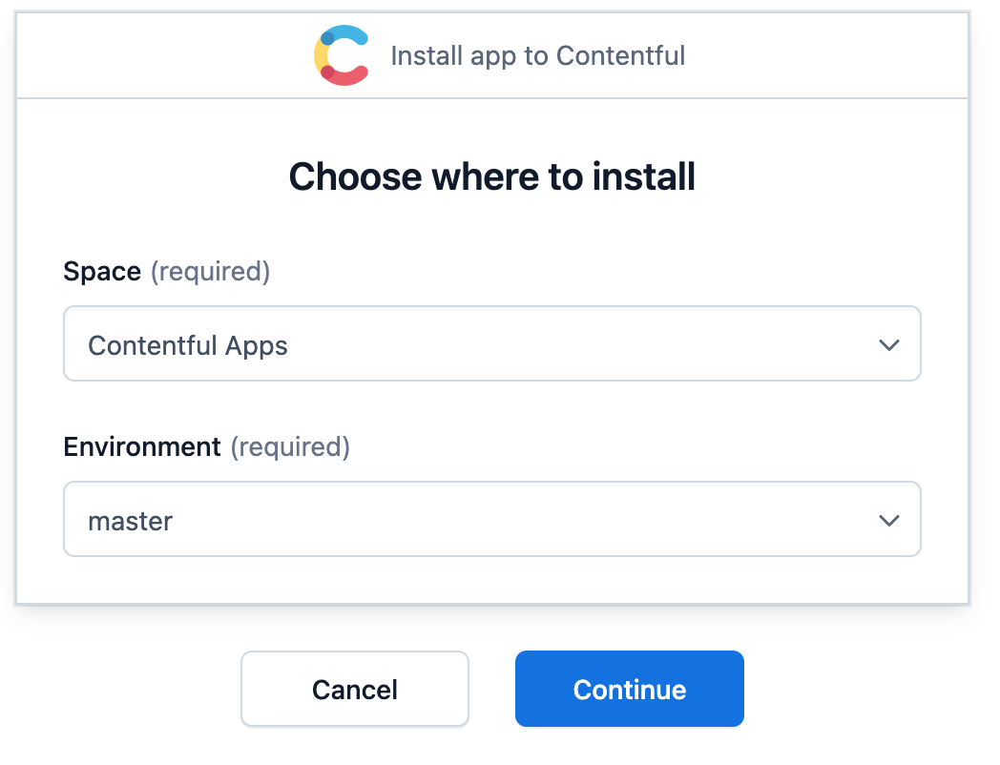

# Contentful URL Manager

[](https://app.contentful.com/deeplink?link=apps&id=kLjkQFK44rW7yaGJq4vQj)

The Contentful URL Manager App is a simple [Contentful App](https://www.contentful.com/developers/docs/extensibility/app-framework/) that provides a way to create a system for generating dynamic URL paths with a tree structure. Additionally, the application allows you to store multiple paths in the same content and utilize them as needed.

## Use Cases

Create paths with depth defined by a hierarchy system of parent and child contents; e.g.:

* `/`: Root content without parents.
* `/parent1/child`: Content under one hierarchical parent.
* `/parent1/child/another-child`: Content under two hierarchical parents.

Create multiple paths in the same content to handle multiple URLs to the same content; e.g.:

* Content to manage the information on a contact page, you can have two paths, such as, `/contact` and `/contact-us`. In implementation it can be handled as independent content (duplicates for that matter), or redirect from one path to the other.

More in progress...

## Installation

### Install APP in your space

[](https://app.contentful.com/deeplink?link=apps&id=kLjkQFK44rW7yaGJq4vQj)



or

### Manual Installation

Install the App using by doing the below steps:

1. Create a new Contentful custom App and define the Application Name (e.g. Broken References)

2. Download this repo and drag the build folder into the Bundles upload zone:


3. Give a name to the bundle


4. Create the required instance parameters


**Parent field name:** [required] short text field for identify the name of the parent field in this content type; remember it must be a reference to another content. ID: parentFieldName, default: parent.

**Slug field name:** [required] short text field for identify the name of the slug field for get the slug of parents. ID: slugFieldName, default: slug.

**Base slug remove:** short text field to manage stripping urls if you have a primary slug can remove this from urlPath. ID: baseSlugRemove.

You can find more details about hosting an [Contentful app here](https://www.contentful.com/developers/docs/extensibility/app-framework/hosting-an-app/)

## Assign APP to your content types


## Create content


*Example of a content that has as parent another content with path `/contentful-url-manager` and this in turn does not have a parent and two extra paths*


## Implementation Example

### 1. NextJS

The following example shows a code snippet that implements the Contentful APP in Next.JS to permanently redirect non-primary URLs.

```javascript
// ...Page component definition

const getPageContent = async (urlPath, preview = false) => {
  if (!urlPath || urlPath === '') {
    throw new Error(`«urlPath» is required`);
  }

  let responseData = null;
  let responseError = null;

  try {
    ({ data: responseData, error: responseError } = await contentfulClient(preview).query({
      query: gql`
        query getPage($urlPath: String!, $preview: Boolean!) {
          pageCollection(where: { urlPaths_contains_some: [$urlPath] }, limit: 1, preview: $preview) {
            items {
              title
              urlPaths
              content
            }
          }
        }
      `,
      variables: {
        urlPath,
        preview
      },
      errorPolicy: 'all'
    }));
  } catch (e) {
    console.error(e);
    responseData = {};
  }

  return responseData?.pageCollection?.items?.[0] ?? null;
}

export const getStaticProps: GetStaticProps = async (
  context: GetStaticPropsContext
): Promise<GetStaticPropsResult<IPage>> => {
  const slugArray =
    typeof context.params.slug === "string"
      ? ["", context.params.slug]
      : ["", ...context.params.slug];
  const slugStringPath = slugArray.join("/");

  const pageContent = await getPageContent(
    slugStringPath,
    context.preview ?? false
  );

  if (!pageContent) return { notFound: true };
  if (pageContent.urlPaths[0] !== slugStringPath) {
    return {
      redirect: {
        destination: pageContent.urlPaths[0],
        permanent: false,
      },
    };
  }

  // ... do stuffs

  return {
    props: {
      pageContent
    }
  }
}
```

## TO DO

1. Improved initial path creation on new content.
2. Update cascading child content when a parent changes its main slug.
3. Add code snippets for multiple frameworks.
4. ...

## Learn More

This project was bootstrapped with [Create Contentful App](https://github.com/contentful/create-contentful-app).
